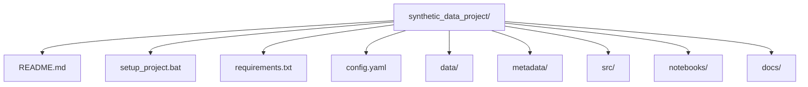
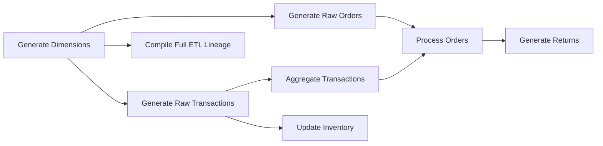

# Project Documentation

This document provides a technical overview and detailed design of the synthetic data generation project. It explains the architecture, data generation methodology, and ETL lineage process. Additionally, it includes Mermaid diagrams to visually represent the repository structure, ETL flow, and schema relationships.

---

## 1. Project Architecture

The project is organized into several key components: synthetic data generation, metadata documentation, and ETL lineage tracking. Below is a high-level view of the repository structure.



- **data/**: Contains the generated CSV files.
- **metadata/**: Contains JSON schema metadata and YAML ETL lineage files.
- **src/**: Houses the Python scripts (e.g., `generate_data.py`) for data generation.
- **notebooks/**: Contains notebooks for data validation and analysis.
- **docs/**: Includes this documentation and other design notes.

---

## 2. Synthetic Data Generation Design

### 2.1 Overview of the Synthetic Schema

The synthetic dataset mimics a data warehouse modeled after the TPC-DS benchmark. It consists of:

- **Dimension Tables:**
  - **Customers:** Profiles including names, contact details, and loyalty status.
  - **Products:** Details like product name, category, sub-category, price, and cost.
  - **Stores:** Information about store locations and regions.
  - **Promotions:** Promotion details with discount rates and effective dates.
  - **Dates:** A date dimension covering one year (optional but included for time-based analysis).

- **Fact Tables:**
  - **Orders:** Order header information linking to customers and stores.
  - **Transactions:** Order line items linking to orders, products, and promotions.
  - **Inventory:** Stock levels per store and product.
  - **Returns:** (Optional) Records of returned items for a subset of orders.

### 2.2 Data Generation Process

The generation process is modular and designed to maintain referential integrity. The steps are documented in the ETL lineage, which tracks each transformation.



**Key Steps:**

- **Generate Dimensions:**  
  Use Faker and (optionally) SDV to create Customers, Products, Stores, Promotions, and Dates tables.

- **Generate Raw Orders and Transactions:**  
  Create a preliminary set of orders and corresponding transactions (1–5 per order) to capture raw sales data.

- **Aggregate and Process Orders:**  
  Compute order totals from transactions and enrich orders with status information.

- **Update Inventory and Generate Returns:**  
  Simulate inventory adjustments based on sales, and generate return records for a subset of orders.

- **ETL Lineage Compilation:**  
  Document each step, its inputs, and outputs in a YAML file to ensure complete traceability.

---

## 3. Schema Documentation

The schema metadata is stored in a JSON file that serves as a data dictionary. It defines each table’s columns, data types, primary keys, and foreign key relationships.

### Sample Schema Metadata (Excerpt)

```json
{
    "tables": {
        "customers": {
            "row_count": 10000,
            "columns": {
                "customer_id": { "type": "INTEGER", "description": "Unique customer identifier" },
                "first_name":  { "type": "VARCHAR(50)" },
                "last_name":   { "type": "VARCHAR(50)" },
                "email":       { "type": "VARCHAR(100)" },
                "phone":       { "type": "VARCHAR(20)" },
                "address":     { "type": "VARCHAR(100)" },
                "city":        { "type": "VARCHAR(50)" },
                "state":       { "type": "CHAR(2)" },
                "zip_code":    { "type": "VARCHAR(10)" },
                "loyalty_status": { "type": "VARCHAR(10)" }
            },
            "primary_key": "customer_id"
        }
        // Additional table definitions follow...
    },
    "relationships": [
        { "table": "orders", "column": "customer_id", "references": "customers.customer_id" },
        { "table": "orders", "column": "store_id", "references": "stores.store_id" }
        // More relationships...
    ]
}
```

---

## 4. ETL Lineage Documentation

The ETL process is documented in a YAML file that outlines the sequence of data generation steps and their interdependencies.

### Sample ETL Lineage (Excerpt)

```yaml
steps:
  - name: generate_dimensions
    description: "Generate base dimension tables using Faker: customers, products, stores, promotions, and dates."
    outputs:
      - data/customers.csv
      - data/products.csv
      - data/stores.csv
      - data/promotions.csv
      - data/dates.csv
  - name: generate_raw_orders
    description: "Generate raw orders by randomly selecting customer, store, and date values."
    inputs:
      - data/customers.csv
      - data/stores.csv
      - data/dates.csv
    output: data/raw_orders.csv
  - name: generate_raw_transactions
    description: "For each order, generate 1–5 raw transactions referencing products and promotions."
    inputs:
      - data/raw_orders.csv
      - data/products.csv
      - data/promotions.csv
    output: data/transactions_raw.csv
  - name: aggregate_transactions
    description: "Aggregate transactions to compute order totals."
    inputs:
      - data/transactions_raw.csv
    output: data/order_aggregates.csv
  - name: process_orders
    description: "Merge raw orders with aggregated totals and assign order statuses."
    inputs:
      - data/raw_orders.csv
      - data/order_aggregates.csv
    output: data/orders.csv
  - name: update_inventory
    description: "Update inventory based on transactions."
    inputs:
      - data/stores.csv
      - data/products.csv
      - data/transactions_raw.csv
    output: data/inventory.csv
  - name: generate_returns
    description: "Generate returns for a subset of orders."
    inputs:
      - data/orders.csv
      - data/transactions_raw.csv
      - data/products.csv
    output: data/returns.csv
  - name: compile_full_lineage
    description: "Compile a comprehensive ETL lineage document from all intermediate steps."
    inputs:
      - data/customers.csv
      - data/products.csv
      - data/stores.csv
      - data/promotions.csv
      - data/dates.csv
      - data/raw_orders.csv
      - data/transactions_raw.csv
      - data/order_aggregates.csv
      - data/orders.csv
      - data/inventory.csv
      - data/returns.csv
    output: metadata/generation_lineage.yaml
```

---

## 5. Future Directions

- **Scaling Up:** Expand the dataset for larger experiments.
- **Advanced SDV Integration:** Improve the realism of synthetic data using SDV’s multi-table synthesizers.
- **System Integration:** Connect the dataset to Snowpark, PySpark, and DuckDB for advanced analytics and query experiments.
- **Hybrid Model Testing:** Use this synthetic data to evaluate your hybrid GNN+LLM framework for enhanced natural language query processing and data lineage tracking.

---

## 6. Running the Project

- **Project Setup:**  
  Run `setup_project.bat` to initialize the repository and Conda environment.
  
- **Data Generation:**  
  Execute `python src\generate_data.py` to generate the synthetic data, metadata, and lineage files.
  
- **Data Validation:**  
  Open `notebooks/data_validation.ipynb` in Jupyter Notebook to validate the data integrity.

---

This documentation provides a comprehensive technical overview of the project, including its architecture, design, and detailed generation process. The diagrams and code snippets help visualize and understand how each component fits together.

Feel free to expand this document as your project evolves!
```